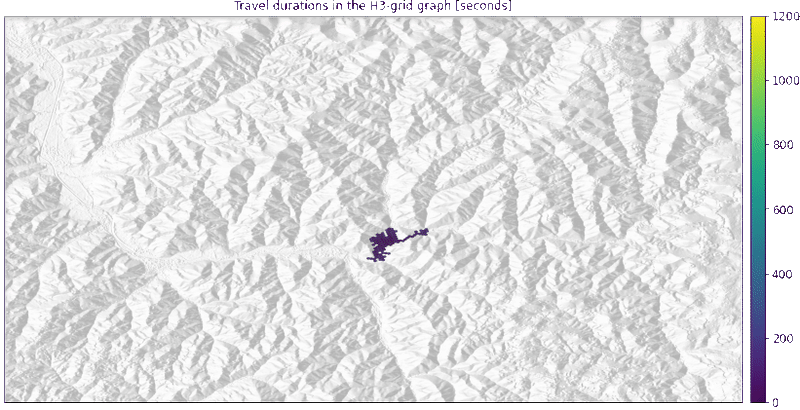
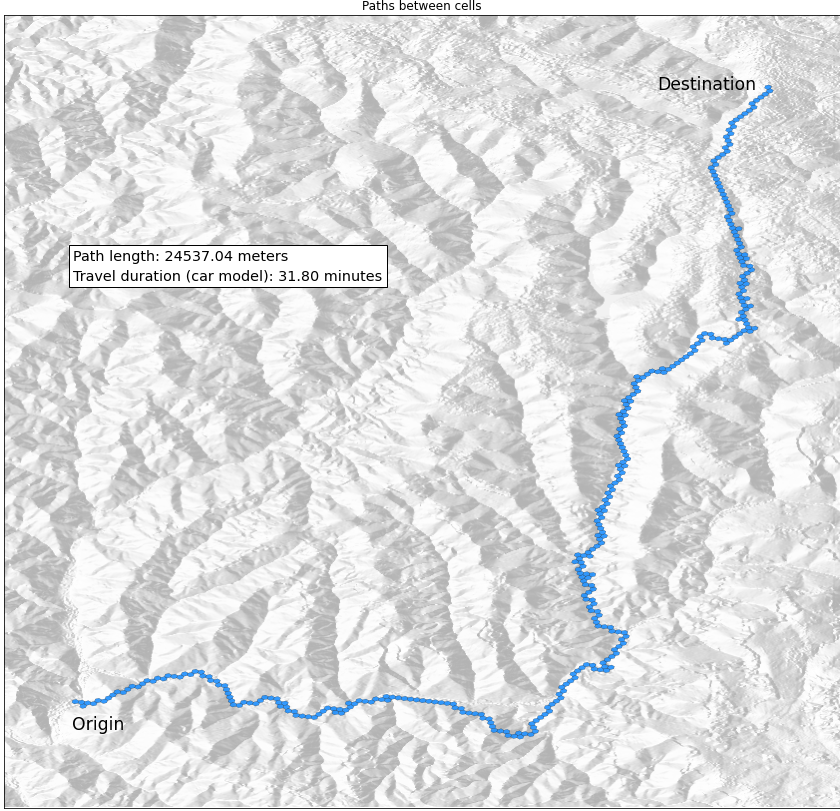
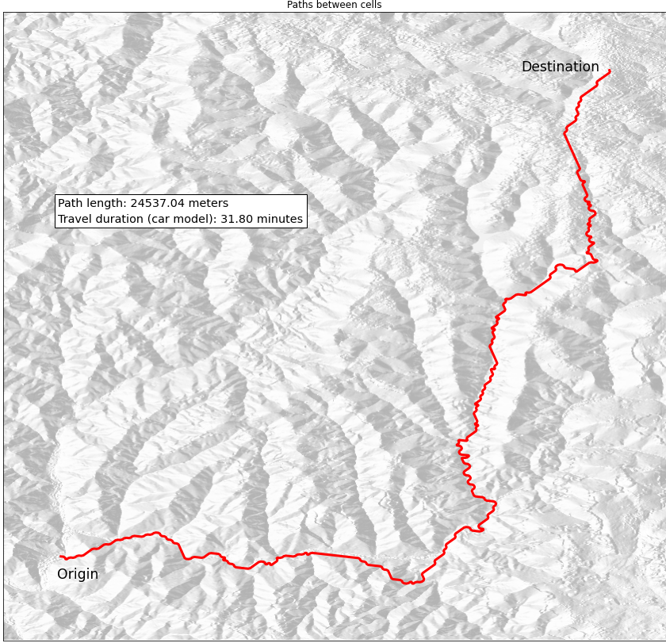

# route3_road

Routing server with GRPC-API and dataframe integration.

Features:

- GRPC API including streaming of tabular data in Arrow IPC file format.
- S3 storage backend.
- Builtin extractor to create graphs from OSM-PBF files.
- Python client library.
- Export of graphs to GDAL vector formats.
- In-memory Cache for loaded graphs and datasets.
- Dynamic loading of supplementary dataset from S3.

Configuration: [config.example.yaml](config.example.yaml)

GRPC API: [route3_road.proto](proto/route3_road.proto)
